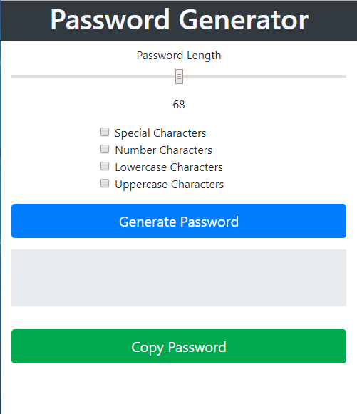
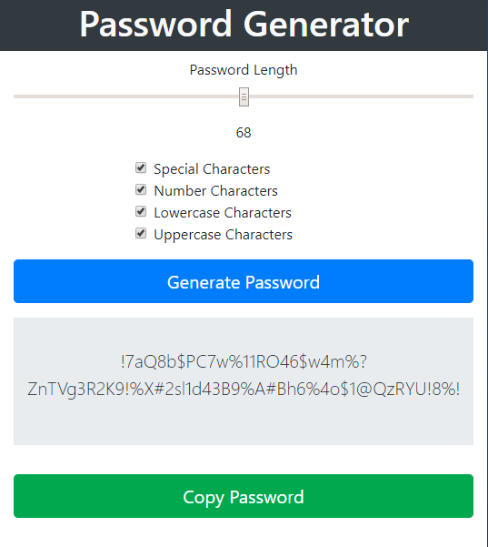
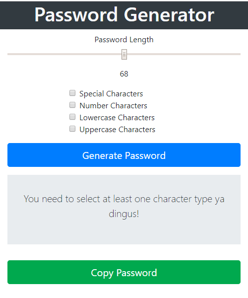

# Password Generator

## Description 
This repository is for creating a password generator. This is for the 3rd homework assignment in my web development class. This password generator can create a randomly generated password from 8-128 characters long. The user has the ability to select what character types to include. If the user does not select any types of characters they will recieve a message to indicate the error. User can continue to generate random passwords. user can copy the generated password.

## Images
Starting View:

Password Generation Example:

Error Message Example:

## Installation 
If all files are kept in a single folder a web browser should be able to run the project and you have an internet connection.

## Usage 
The usage of this is just for me to practice HTML, CSS, and javascript. It could be used to generate random passwords.

## Credits 
I created this code based on the homework prompt created by Triology Education Services. Certain pieces of code I used online resources for help. I have included citations in the form of comments throughout the html and javascript.

## Contributing 
I was the only one to work on this project, but of course I had help from my instructor, TA's, and classmates.

## Challenges
Early on I tried creating an array that included the names of each character array. I was hoping I could use this array to select each array at random. Turns out you can't use strings to as variable names due to the way Javascrit works. I think this could have been possible by creating an object that contained the arrays, but since we haven't done a deep dive on objects yet, I decided to figure out how to complete the assignment without using functionality of objects. I quickly realized my strategy included copy pasting my code multiple times to achieve my end result. I am well aware that my code is not even close to D.R.Y. and a combonation of functions and using objects could probably make it more dry, but I ran out of time to simplify the code.

## Live site: 
https://sirpotatoiv.github.io/password-generator/

## License
[MIT](https://choosealicense.com/licenses/mit/)